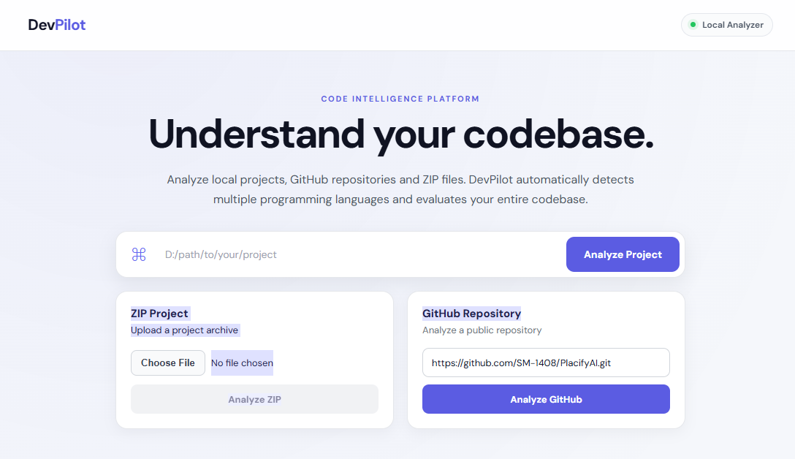
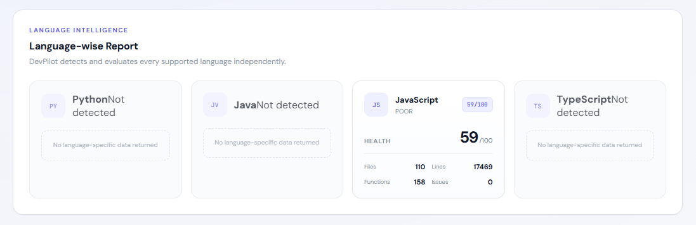
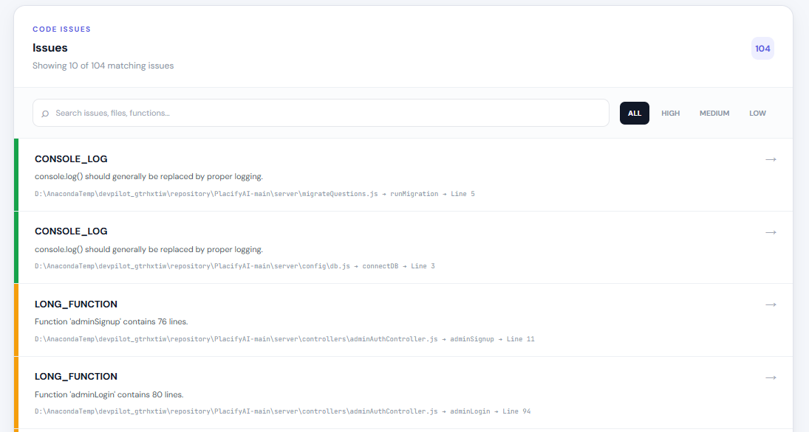
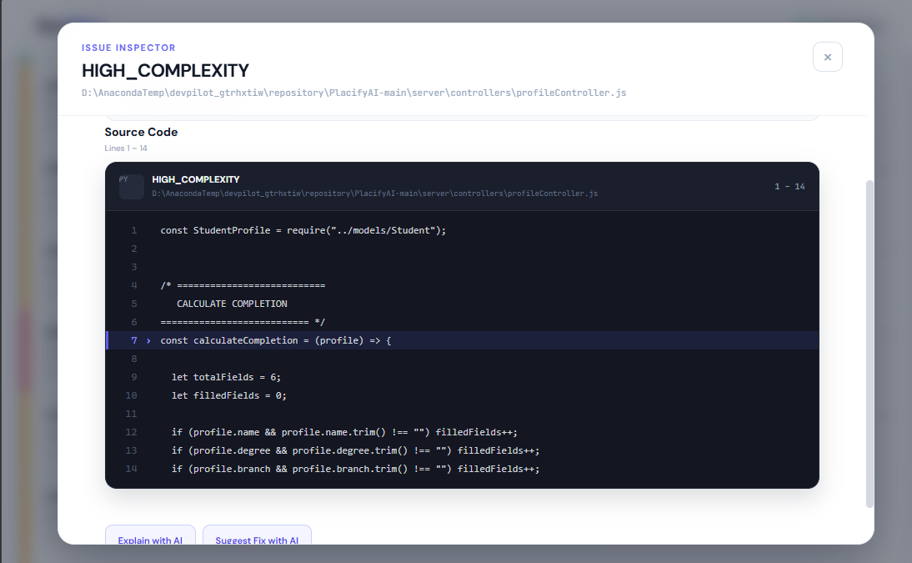
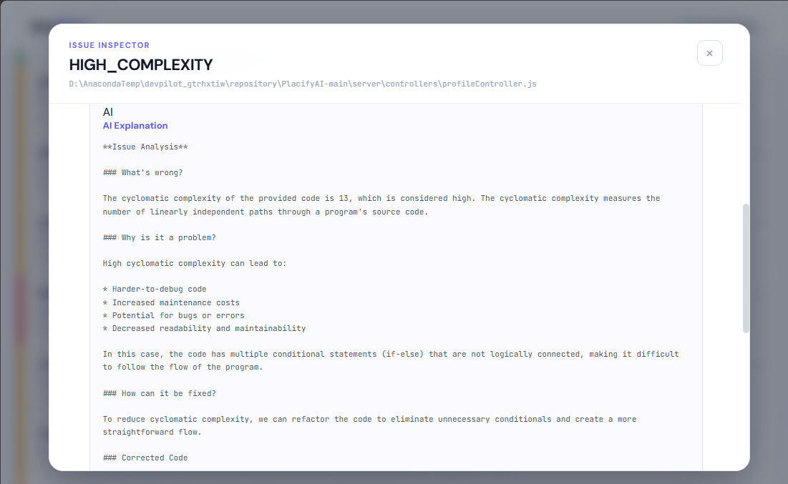
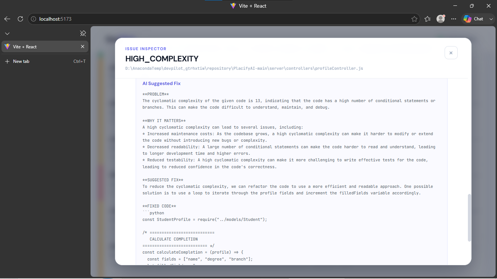
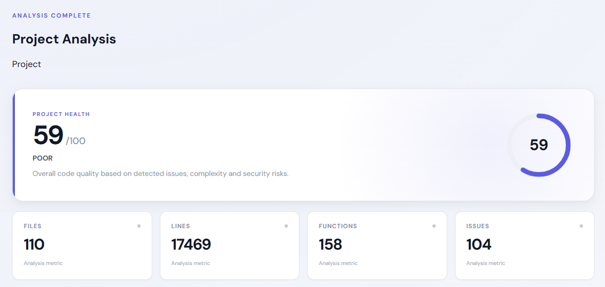

<h1 align="center">🚀 DevPilot</h1>
<p align="center">
  <strong>AI-Powered Code Analysis & Developer Intelligence Platform</strong>
</p>

<p align="center">
  Understand your code. Detect problems. Improve quality. Build better software.
</p>

<p align="center">


</p>

---

<p align="center">
  
</p>

---

## 📌 Overview

**DevPilot** is an AI-powered code analysis and developer intelligence platform designed to help developers understand, inspect, and improve their software projects.

Instead of manually searching through large codebases, DevPilot analyzes a project and provides useful insights such as:

- 📊 Project health score
- 🐛 Code issues
- 🔐 Security problems
- 🧠 Code intelligence
- 🌐 Language distribution
- 📄 Source code inspection
- 🤖 AI-powered explanations
- 🛠️ AI-powered fixes
- 📦 Project structure analysis
- 🔗 Public GitHub repository analysis

DevPilot supports multiple programming languages and multiple project input methods, making it useful for both individual developers and software teams.

---

# ✨ Why DevPilot?

Modern software projects can quickly become difficult to understand and maintain.

Large codebases may contain:

- Complex functions
- Repeated logic
- Security risks
- Poor coding practices
- High-complexity code
- Hardcoded secrets
- Unsafe execution methods
- Multiple programming languages
- Difficult-to-understand source files

DevPilot provides a centralized analysis system that helps developers identify these problems and understand their projects faster.

---

# 🚀 Core Features

## 📊 Project Health Score

DevPilot calculates an overall project health score between **0 and 100**.

The score considers different categories of issues including:

- HIGH severity issues
- MEDIUM severity issues
- LOW severity issues
- High-complexity code
- Security-related issues

### Health Ratings

| Score | Rating |
|------:|--------|
| 90 – 100 | 🟢 EXCELLENT |
| 75 – 89 | 🔵 GOOD |
| 60 – 74 | 🟡 FAIR |
| 40 – 59 | 🟠 POOR |
| 0 – 39 | 🔴 CRITICAL |

The scoring system uses bounded penalties so that a large number of low-severity issues does not automatically reduce the project score to zero.

---

## 🐛 Issue Detection

DevPilot scans source code and identifies potential problems.

Issues are categorized according to their severity.

| Severity | Description |
|----------|-------------|
| 🔴 HIGH | Important problems that should be addressed |
| 🟠 MEDIUM | Problems that may affect quality or maintainability |
| 🟡 LOW | Minor issues and improvement opportunities |

The dashboard provides a centralized view of detected issues.

---

## 🔐 Security Analysis

DevPilot also checks for potentially dangerous coding patterns.

Current security-related detections include:

- Dangerous `eval()` usage
- Dangerous `exec()` usage
- Process execution
- Hardcoded secrets
- Other potentially unsafe patterns

Security issues receive additional weight in the project health calculation.

---

## 🧠 Code Intelligence

DevPilot analyzes the internal structure of your source code.

It can identify and analyze:

- Functions
- Classes
- Methods
- Imports
- Variables
- Code structure
- Complexity
- Language distribution

This helps developers understand unfamiliar projects without manually inspecting every file.

---

## 🌐 Multi-Language Support

DevPilot currently supports:

- 🐍 Python
- ☕ Java
- 🟨 JavaScript
- 🔷 TypeScript

The system can analyze projects containing multiple supported programming languages.

---

# 📈 Language Intelligence

DevPilot provides language-level statistics so developers can understand the composition of their project.

The system can identify:

- Programming languages used
- Number of files per language
- Lines of code
- Language distribution
- Language-specific health information

### Example

<p align="center">
  
</p>

---

# 🐛 Code Issues

DevPilot provides a dedicated issue analysis view where detected problems can be inspected.

<p align="center">
  
</p>

The issue analysis helps developers quickly identify which parts of the project require attention.

---

# 📄 Source Code Inspector

DevPilot includes a source-code inspection system that allows developers to inspect the actual source code associated with detected issues.

The inspector provides:

- File path
- Target line
- Surrounding source code
- Line numbers
- Highlighted target line
- Context around the detected issue

<p align="center">
  
</p>

This makes it easier to understand exactly where a problem exists instead of only displaying an issue message.

---

# 🤖 AI-Powered Code Explanation

DevPilot integrates AI functionality to help developers understand their code and detected issues.

The AI explanation system can explain:

- What the issue means
- Why the issue exists
- Why it matters
- How the code behaves
- What should be changed

<p align="center">
  
</p>

---

# 🛠️ AI-Powered Code Fix

DevPilot can also provide AI-assisted fixes for detected problems.

The fix system is designed to help developers understand:

- What should be changed
- Why the change is required
- How the corrected code should look
- How the modification improves the source code

<p align="center">
  
</p>

---

# 🩺 Health Score & Project Analysis

The health dashboard provides a high-level overview of the project.

It combines multiple analysis results into a single developer-friendly view.

<p align="center">
  
</p>

The health system helps developers quickly answer:

> "How healthy is this project?"

and

> "What should I fix first?"

---

# 📦 Project Analysis Sources

DevPilot supports multiple ways of providing a project.

## 1. 📁 Local Project

Developers can analyze a project located on their local machine.

DevPilot scans the project structure and analyzes supported source files.

---

## 2. 📦 ZIP Upload

Developers can upload a project as a ZIP archive.

DevPilot extracts the project and performs the analysis automatically.

---

## 3. 🌐 Public GitHub Repository

DevPilot can analyze public GitHub repositories directly.

The workflow is:

```text
GitHub Repository
       ↓
Repository Download
       ↓
Project Extraction
       ↓
File Discovery
       ↓
Language Detection
       ↓
Code Analysis
       ↓
Issue Detection
       ↓
Health Score
       ↓
Developer Intelligence Report

```
# 🧰 Tech Stack
## Frontend
- React
- Vite
- JavaScript
- CSS
- Fetch API
## Backend
- Python
- FastAPI
- Uvicorn
- Pydantic
## Code Analysis
- Python AST / static analysis
- Java source analysis
- JavaScript analysis
- TypeScript analysis
- Regex-based security and pattern detection
## AI
- AI-powered code explanation
- AI-powered code fixing
## Integration
- GitHub public repository analysis
- ZIP project uploads
- Local project analysis

# 💡 How DevPilot Helps Developers
DevPilot brings several development tools together into one platform.
Instead of using separate tools for:

```txt
Code Analysis
      +
Security Checks
      +
Project Health
      +
Language Intelligence
      +
Source Inspection
      +
AI Explanation
      +
AI Fixes

```
DevPilot provides a centralized developer intelligence platform.

# 👨‍💻 Author
## SM-1408
Built with:
- Python
- FastAPI
- React
- JavaScript
- TypeScript
- Java
- AI
